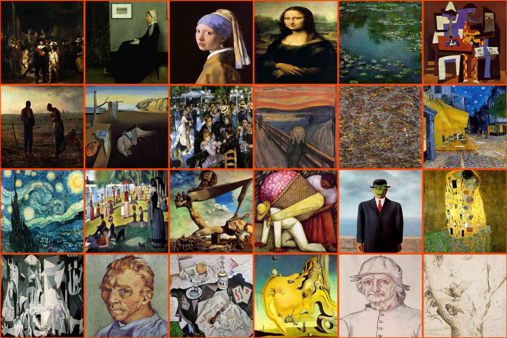

[](https://www.sciencedirect.com/science/article/pii/S2352711024002097?ref=cra_js_challenge&fr=RR-1)

# p5.quadrille.js

[p5.js](https://p5js.org/) [quadrille](https://en.wikipedia.org/wiki/Square_tiling) open source library designed for implementing various [puzzle video games](https://en.wikipedia.org/wiki/Puzzle_video_game) and conducting visual computing experiments.



In geometry, the square-tiling, square-tessellation or square-grid is a regular tiling of the Euclidean plane. [John Horton Conway](https://en.wikipedia.org/wiki/John_Horton_Conway) called it a quadrille.

The internal angle of the square is π/2 so four squares at a point make a full 2π angle. It is one of three regular tilings of the plane. The other two are the [triangular-tiling](https://en.wikipedia.org/wiki/Triangular_tiling) and the [hexagonal-tiling](https://en.wikipedia.org/wiki/Hexagonal_tiling).

## Features

The library comprises a `Quadrille` class and provides [p5 functions](https://objetos.github.io/p5.quadrille.js/docs/p5_functions/) to manipulate instances of it, even allowing to [customize the quadrille tiling](https://objetos.github.io/p5.quadrille.js/docs/p5_functions/draw_quadrille/#display-functions). The `Quadrille` class supports several read/write [properties](https://objetos.github.io/p5.quadrille.js/docs/properties/) and implements:

- [Geometry transformations](https://objetos.github.io/p5.quadrille.js/docs/geometry_transformations/)
- [Boolean operators](https://objetos.github.io/p5.quadrille.js/docs/boolean_operators/) (inspired by [constructive solid geometry](https://en.wikipedia.org/wiki/Constructive_solid_geometry))
- [Visual computing](https://objetos.github.io/p5.quadrille.js/docs/visual_computing/) methods such as image filtering using [convolution matrices](https://en.wikipedia.org/wiki/Kernel_%28image_processing%29) and [triangle rasterization](https://fgiesen.wordpress.com/2013/02/06/the-barycentric-conspirac/)
- Several [immutable](https://objetos.github.io/p5.quadrille.js/docs/immutable_methods/) and [mutable](https://objetos.github.io/p5.quadrille.js/docs/mutable_methods/) methods, such as `clear`, `clone`, `fill`, `insert`, `replace`, `sort`

It can also be used as an interface to convert to/from other representations such as [arrays](https://developer.mozilla.org/en-US/docs/Web/JavaScript/Reference/Global_Objects/Array), [images](https://p5js.org/reference/#/p5.Image), and [bitboards](https://en.wikipedia.org/wiki/Bitboard).

The library reference which illustrates most of its functionality is available on the [documentation site](https://objetos.github.io/p5.quadrille.js/).

---

## Usage

### ✅ Option 1. ESM Module (npm)

```bash
npm install p5 p5.quadrille
```

```js
import p5 from 'p5'
import Quadrille from 'p5.quadrille'

const sketch = (p) => {
  let q

  p.setup = () => {
    p.createCanvas(400, 400)
    q = p.createQuadrille(4, 4)
    q.fill(0, 0, 'white')
    p.drawQuadrille(q)
  }
}

new p5(sketch)
```

### ✅ Option 2. Browser Script (CDN)

```html
<script src="https://cdn.jsdelivr.net/npm/p5@2.0.0-beta.5/lib/p5.min.js"></script>
<script src="https://cdn.jsdelivr.net/gh/objetos/p5.quadrille.js@main/dist/p5.quadrille.iife.js"></script>
<script>
  let q
  function setup() {
    createCanvas(400, 400)
    q = createQuadrille(4, 4)
    q.fill(0, 0, 'white')
  }

  function draw() {
    background('blue')
    drawQuadrille(q)
  }
</script>
```

---

## Build & Test

To build the library and run example tests using Vite:

### 🔧 Build the library

Generates `iife` and `esm` builds in the `dist/` directory.

```bash
npm run build
```

### 🚀 Run ESM test example (Vite)

Inside the `test-npm-esm/` directory:

```bash
cd test-npm-esm
npm install       # installs p5, vite, and applies patch for beta.5
npm run dev       # launches local dev server at http://localhost:5173/
```

You can then import the library as:

```js
import p5 from 'p5'
import Quadrille from 'p5.quadrille'
```

✅ Works with [Vite](https://vitejs.dev) and will be compatible with the upcoming [p5.js v2](https://github.com/processing/p5.js/pull/5746) release.

---

## Releases

- [p5.quadrille.js (main build)](https://raw.githubusercontent.com/objetos/p5.quadrille.js/main/p5.quadrille.js)
- [CDN: p5.quadrille.js](https://cdn.jsdelivr.net/gh/objetos/p5.quadrille.js/p5.quadrille.js)
- [CDN: p5.quadrille.min.js](https://cdn.jsdelivr.net/gh/objetos/p5.quadrille.js/p5.quadrille.min.js)
- [All Releases](https://github.com/objetos/p5.quadrille.js/releases)

---

## Contributing

Contributions are welcome at the [GitHub repository](https://github.com/objetos/p5.quadrille.js).