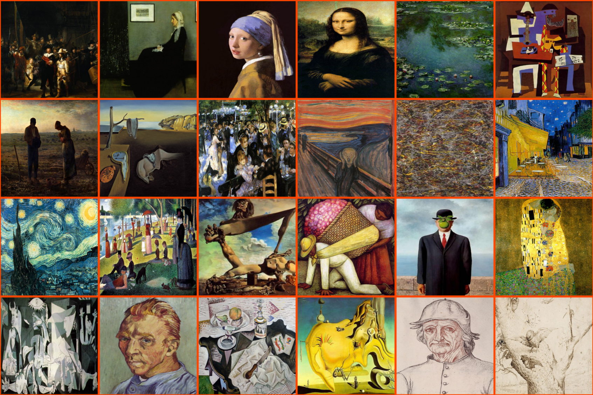

# p5.quadrille.js

[p5.quadrille.js](https://github.com/objetos/p5.quadrille.js) is an open-source [p5.js](https://p5js.org/) library tailored for students, visual artists, and game designers. It supports the creation of [grid-based games](https://objetos.github.io/docs/intro/gbg/) and the exploration of visual algorithms.

Anchored in the [quadrille](https://en.wikipedia.org/wiki/Square_tiling) concept, which is fundamental to numerous graphics applications, the library opens avenues for crafting traditional grid-based games and exploring algorithmic visuals from color data-based sorting to software-based image processing and rasterization.

At the heart of the library lies the `Quadrille` class, couple with some [p5.js functions]() that allow manipulation and customization of all the quadrille visual appearance aspects. The class provides a set of [properties](), some read-only like [mouseRow](), [mouseCol](), [size]() and [order](), and others read-write such as [width](), [height]() and [memory2D](). The class also offers methods to perform geometric [transformations](), conduct [algebraic operations]() inspired by [constructive solid geometry](https://en.wikipedia.org/wiki/Constructive_solid_geometry), and perform [visualizations]() involving image filtering with [convolution matrices](https://en.wikipedia.org/wiki/Kernel_%28image_processing%29) and [triangle rasterization](https://fgiesen.wordpress.com/2013/02/06/the-barycentric-conspirac/). Additionally, the class includes various [accessors]() such as [queries](), [cell contents](), and [instance creators](), along with [mutators]() like [delete](), [insert](), [randomize](), [rand](), [swap](), [replace](), [clear](), [fill]() and [sort]() (used to order the images within the logo above), which allow for detailed customization and manipulation of the quadrille's state. Moreover, [reformatters]() within the library enable seamless transformation between quadrille instances and various data formats, such as [arrays](https://developer.mozilla.org/en-US/docs/Web/JavaScript/Reference/Global_Objects/Array), [images](https://p5js.org/reference/#/p5.Image), [bitboards](https://en.wikipedia.org/wiki/Bitboard) and [Forsyth–Edwards Notation (FEN)](https://en.wikipedia.org/wiki/Forsyth%E2%80%93Edwards_Notation) chess board positions.

The library reference which illustrates most of its functionality is found along this site.

Contributions are welcome at the [GitHub library site](https://github.com/objetos/p5.quadrille.js).

# p5.js Web Editor

(short intro and hacking instructions to hands-on coding right-away are missed here)

(mouse presses to `randomize` the `quadrille` [Pola](https://en.wikipedia.org/wiki/Policarpa_Salavarrieta); key presses resets it)  
<iframe src="https://editor.p5js.org/nakednous/full/FTG5xADBA" width="600" height="642"></iframe>

# Releases

- [p5.quadrille.js](https://raw.githubusercontent.com/objetos/p5.quadrille.js/main/p5.quadrille.js)
- [CDN: p5.quadrille.js](https://cdn.jsdelivr.net/gh/objetos/p5.quadrille.js/p5.quadrille.js) and [p5.quadrille.min.js](https://cdn.jsdelivr.net/gh/objetos/p5.quadrille.js/p5.quadrille.min.js)
- [All Releases](https://github.com/objetos/p5.quadrille.js/releases)
